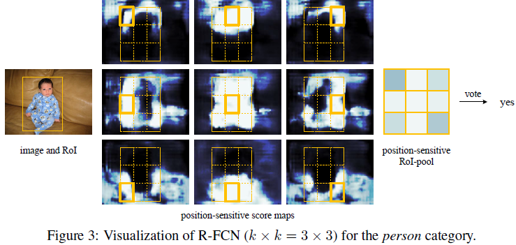
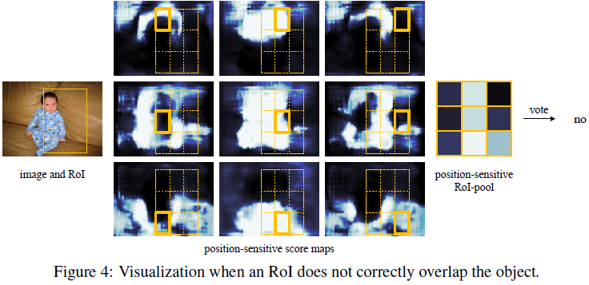
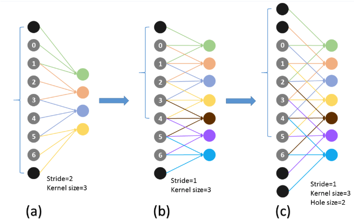

##  动机

 1. 如何提高检测网络的检测速度？
 2. 如何共享特征提取层的计算，减少计算？
 3. Faster-RCNN网络没有共享所有卷积层，ROI Pooling层之后的部分包含全连接层，被重复计算，全连接层比卷积层计算更费时间
 4. 分类时我们希望延续平移不变性（物体移动到任何位置都能准确分类），检测时我们希望平移变化性（物体移动，我们得准确定位目标），矛盾点。
   

## _问题回答_

 1. *对第一个问题的回答*：传统的Faster-RCNN网络将网络分成三个子网络部分，第一个是特征提取网络；第二个是RPN网络用于ROIs的提取，第三个网络是ROI Pooling层之后的分类和回归层；前两个网络是计算共享的，最后一个网络对每一个proposal都计算一遍，比较耗时；

 2. *对第二个问题的回答*：Faster-RCNN网络是将RPN网络插入到ResNet网络的第5个block之前，增加了检测部分的深度，提高了检测的精度；第5个block作为分类和回归网络 ，插入了RPN网络改变了conv5原本作为分类网络的平移不变性，开始对位置信息比较敏感；
 3. _对第三个问题的回答_：由于Faster-RCNN网络中存在着较深的检测网络，存在着未共享计算，冗余比较大；将所有计算都进行共享，也就是说将conv5的计算放到共享计算部分；故而提出了一个新的网络解决此三个问题。

## _全新网络介绍_

### *分类网络说明*

 1. _网络说明_:将resnet101所有卷积层用作特征提取器，在100层后面接一个1x1x1024维的卷积核(全卷积网络)，将原来的2048维的特征降维到1024维，然后再在后面接k^2^(C+1)维的卷积核，提取到position-sensitivity score map,k在文章中为3，C在文章中表示类别，RPN网络也是使用ResNet后面的1024维特征进行候选框的生成；
网络结构图如下所示：
通过全卷积网络生成的kxk=3x3的position-sensitive score map,kxk表示将特征图上的目标位置分成3x3的bin，每个bin的维度是C+1，表示该目标类别的左上、左中、........等位置信息。
 2. 通过RPN网络生成的ROI区域，也就是anchor坐标，是在WxH尺寸的特征图上面生成的边框，将这个ROI分成KxK个bin区域，position-sensitivity score map的维度为WxHxk^2^(C+1),也就是说生成的ROI会将score map对应位置的K^2^个位置组成下图的情形：
 
 
 3. 将对应好的k*k*(C+1)score map 进行平均/最大池化操作，生成kxk大小，维度为C+1的score map,第（i,j）位置的（C+1）向量表示的是KxK（C+1）对应位置的bin网格中的（C+1）通道的平均池化， 然后对这些score map进行投票，投票的时候使用的是平均分数，为每个ROI产生一个（C+1）维的向量，然后通过softmax进行分类操作。
    
### _边框回归网络介绍_

1. 使用一个4k^2^维的卷积层来进行边框回归，使用position-sensitive ROI池化 对这个4k^2^score map进行池化操作，为每一个ROI生成一个4k^2^维向量，然后通过平均投票生成一个4维坐标向量。*这里为了简化，使用的是类别不指定操作，维度只有4k^2^维，若是指定类别的话，那么最后一层卷积层的维度变成4k^2^*C*;
  

### _使用的技巧_

 *À trous*：使用修正了的全卷积网络，为了增加score map的像素，将ResNet-101的stride从32像素变成16像素，但是stride变小的时候出现一个问题，视野域产生了变化。这里采用了一个hole algorithm来扩大视野域，如下图所示：
 
*hole-algorithm解释*：在平常的卷积或者pool化层，filter滤波器相邻的权重作用在feature map上的位置是物理连续的，如图(a)所示，为了不改变视野域，当stride从2变成1时，filter的连续连接关系就得根据hole size的大小变成skip连接，pool4的stride由2变为1，则紧接着的conv5_1, conv5_2和conv5_3中hole size为2。接着pool5由2变为1, 则后面的fc6中hole size为4。扩张卷积如图所示：

   
