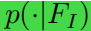
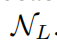
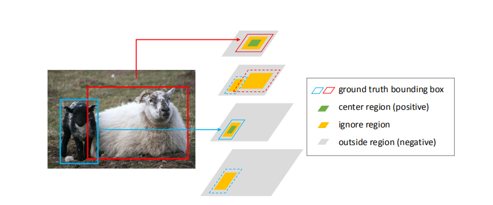

## 摘要总结

 1. 总结了之前使用的anchor-based方法，发现其不够高效和有用，因为产生了非常密集的anchor，但是大部分是负样本；
 2. 本文首先*预测目标的位置*，然后*预测该位置的anchor形状*，然后使用特征适应模块减少特征的不连续性；
 3. 研究发现了高质量的proposals可以改变检测器的性能；
 4. 提出的Guided-anchor方法能够无缝地整合进双阶段和多阶段检测器中，在MS COCO上面实现9.1%的recall，但是anchor数量却少了将近90%；

## 引言总结

 1. anchor设计需要遵循两个基本的规则：
    **对齐**：anchor中心需要特征图上面的像素对齐；
	**一致性**：在特征图不同位置上的anchor形状和尺寸应该和视野域和语义范围一致；
 2. 基于滑窗的方法是满足这两个条件的最简单的方法；
 3. 传统的基于滑窗的方法存在两个困难：
     **不够灵活**：固定尺寸的anchor需要针对不同的问题提前设置，若是设置不合理时，就会阻碍检测器的表现；
	 **anchor数量多**：为了维持比较高的recall，需要许多的anchor，其中大量为false anchor,增加了计算量；
 4. **灵感产生**：由于目标不是均匀的分布在图片上，所以不需要在图片上的每个位置都产生anchor，只需要在存在目标的地方产生anchor就可以；目标尺寸与图片内容、目标位置以及场景的几何形状有关。
 5. *本方法的步骤*：
     **识别可能包含目标的子区域**
	 **决定不同位置的形状**
 6. 提出的方法需要解决的问题
    **一致性问题**：由于anchor的形状和尺寸不固定，打破了之前提出的一致性要求，必须使用一种新的方法来学习anchor的特征表示；
	**非对齐问题**：提出特征适应模块使特征图上的像素根据anchor形状和anchor对齐；
 7. 主要贡献
     **提出了一种新的anchor方案，能够预测任意形状的anchor**
	 **使用两个条件向量分布表示联合anchor分布，使用两个模块分别生成这两个条件向量**
	 **将特征图和anchor对齐，设计了一种特征适应模块**
	 **试验了高品质的候选框对于两阶段或者多阶段检测器的重要性**
	 
## Guided Anchoring
 
  1. 在本文中，将一个目标的位置和形状向量化为一个4维的向量（x,y,w,h），（x,y）表示目标的中心位置，（w,h）表示目标的宽和高；对于任何一张图片I，目标的位置和形状遵循下面的分布；
        
	 *对于任何一张图，目标可能只存在于确定的区域*
	 *一个目标的形状与其位置紧密相关*
   2. 对于这个分布函数，设计了一个anchor产生模块，该模块由两个分支组成，一个分支用来进行定位目标的位置，另外一个用来生成目标形状的anchor；如下图所示：
      
	  图片提取特征=>位置预测分支产生概率图指出目标可能存在的位置=>形状预测分支预测基于位置的形状=>最后由这两个分支得到anchor输出

   *通过选取给定可能性阈值之上的位置处的目标，并选取该位置处最可能的形状作为anchor*
   **由于anchor形状可以产生变化，所以不同位置的特征应该抓住不同范围内的视觉内容，因此设计了一个特征适应模块，根据anchor形状调整特征图**

## Anchor 位置预测

 1. 对于特征图anchor 位置预测分支产生和输入特征图一样尺寸的概率图，对于每一个位置的概率值P(i,j|FI),表示在特征图上面中心坐标位置为((i+0.5)s,(j+0.5)s)的概率，表示一个目标中心存在在那个位置的可能性；
 2. 上面提到的概率值是由一个子网络产生的，该网络对于基本特征图使用1x1卷积获得目标分数图，然后使用**sigmoid函数**将目标分数值转换成可能值；在这里实验性地发现一层卷积层+sigmoid函数能够产生精度和效率地平衡；
 3. 根据概率阈值，我们选择这些目标很可能存在的这些区域，这个过程可以过滤掉超过90%的区域，但是仍然维持相同的召回率；产生的概率图如下所示：，从图中可以看出来，天空和海洋等背景被排除在外，目标区域的概率值高于周边环境；
    
## Anchor 形状预测
   1. 该分支根据上一步的位置预测，进行anchor形状预测，它与边框回归不同的地方在于：不需要改变anchor的位置，不会造成anchor和anchor特征图的对不准情况的出现；
   2. 给一张特征图F，该分支将给为每一个位置预测最好的形状(w,h),生成该形状的指导是使生成该形状的anchor可以和ground truth 由最大的重叠区域；
   3. **Note**:该分支的主要目标是预测anchor的宽度值w和高度值h,由于这两个值的变化范围非常大，所以直接预测这两个值可能造成训练的不稳定，所以对问题进行一次迁移变化：
      
  4. 形状预测函数将输出dw和dh，这两个值然后被映射为（w,h），s为stride，σ表示实验尺度向量（实验的过程中设置为8），该非线性迁移函数将输出空间从[0,1000]映射到[-1,1]，是的训练过程变得更容易和更稳定；
  5. 该分支网络都是由1x1卷积层组成，输出为两通道的特征图，分别表示dw和dh，最后是一个元素迁移层，用来计算anchor的形状（w,h）；
    **本方案可以生成任意形状的anchor，anchor的形状与位置有很大的关系，使得本方案的recall高于之前提前定义的密集anchor生成**
	
## Anchor-Guided Feature Adaptation
   1. 直觉：对于大的anchor，特征图应该编码一个大区域的内容，对于小的anchor,特征图应该编码小范围的内容；（这里在整个特征图上面使用全卷积）；
   2. 引入anchor指导的特征适应性模块，在 每个单独的位置根据anchor的形状变换特征，变换的公式如下：
                          
fi 表示第i个位置的特征，(wi, hi)是相应的anchor形状；因为该公式表示依赖于位置的变化，所以采用3x3变形卷积来实施NT；
    3. 首先从anchor形状预测分支的输出预测一个抵消区域，然后使用抵消区域在原来的特征图上运用变形卷积
获得fi，然后在fi特征的上面可以运用分类和边框回归；

## 训练

 1. 共同的目标
    *本框架使用多任务损失：分类损失、回归损失、anchor位置预测损失、anchor形状预测损失*，联合损失函数如下所示：
	
  2. anchor 定位的目标：
      为了训练一个anchor定位网络，对于每一张图片，使用一个二进制标签图 ，1表示该位置是一个有效位置可以放置anchor,0表示该位置几乎不存在目标，不用放置anchor；*在此过程中使用ground-truth边框指导二进制标签图生成*
目的是在目标中心毗邻区域放置尽可能多的边框；
 3. 生成二进制map的步骤
   +  *将gt边框映射到特征图尺寸大小* (xg, yg, wg, hg)=> (x'g, y'g, w'g, h'g),定义R(x, y, w, h)为中心坐标为(x, y)、尺寸为wxh的矩形区域；
   + 希望将anchor放置到gt目标的中心附近以获得更大的初始IOU，为每个box定义了三种区域；
   + 1 : CR = R(x‘g, y’g, σ1w‘, σ1h’)表示box的中心区域，在该区域的像素被当作正样本；
   +  2：IR = R(x'g, y'g, σ2w', σ2h')\CR 是一个包含CR的区域 (σ2 > σ1)，在IR中间的像素在训练过程中被当成‘ignore’并被排除；
   +  3：外部区域OR是除了IR和CR之外的区域，在OR中的像素被当成负样本；
 4. 使用FPN多层特征，*每层特征图应该只针对特定尺寸范围的目标*，只要特征图匹配目标物体的尺寸，我们就把CR放置到特征图上面，相邻特征层的对应位置放置IR；
 5. 在多目标重叠时，CR抑制IR，IR抑制OR **此处不是特别明白**，示意图如下：
     
	 因为CR通常占据了整个特征图的一小部分，在训练的位置分支的过程中使用focal loss；**猜测这里使用focal loss是因为正样本相比于负样本来说只占据一小部分，所以使用focal loss来进行均衡采样**
	 
  6. Anchor 形状预测任务，有两步决定形状预测：
   + 首先，需要匹配anchor到gt box；
   + 其次，预测anchor的宽和高，使得anchor能够更好的和gt box重叠；
     